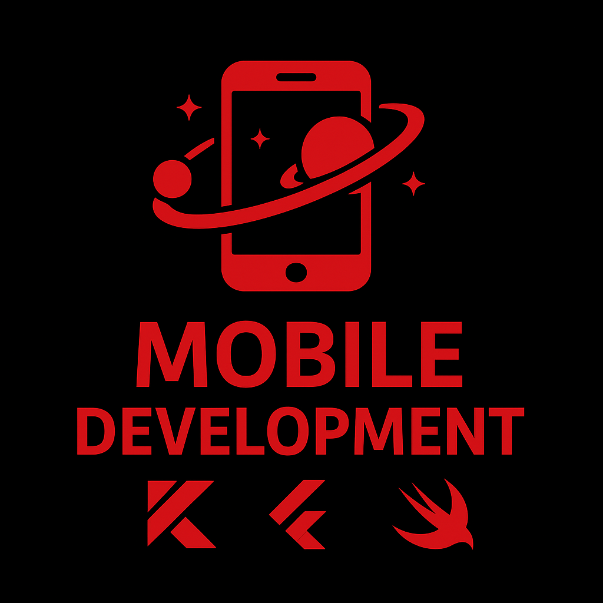

# 🚀 Mobile Development Roadmap


---

### 📑 Table of Contents

- [Introduction](#-introduction)
- [Core Stack](#-core-stack)
- [Android Development](#-android-development)
- [iOS Development](#-ios-development)
- [Cross-Platform](#-cross-platform)
- [Portfolio](#-portfolio)
- [Software Engineering](#-software-engineering)
- [Version Control](#version-control)
- [Cloud Computing](#cloud-computing)

---

### 💡 Introduction

Your complete guide to mastering Mobile Development with Kotlin, Flutter, and Swift.

Welcome to Mobile Development Roadmap — an open-source project built to help you understand the art and science of
mobile Development.
Whether you’re starting your journey or expanding your expertise, this roadmap guides you through every step of creating
powerful, modern apps for Android and iOS.

Here you’ll explore:

📱 Structured paths for Android, iOS, and Cross-Platform development

🧠 Core principles of software engineering applied to mobile apps

🧩 Key technologies, frameworks, and tools you’ll actually use

☁️ Cloud, DevOps, testing, and deployment workflows

💡 Real-world practices to help you think like a mobile engineer

---

### ✨ Core Stack

| Platform           | Language | UI Framework    |
|--------------------|----------|-----------------|
| **Android**        | Kotlin   | Jetpack Compose |
| **iOS**            | Swift    | SwiftUI         |
| **Cross-Platform** | Dart     | Flutter         |

---

## 🤖 Android Development

### 0) ⚙️ System & Tooling Setup

Goal: A fast. stable dev environment.

* Operating System :
    * Linux (Ubuntu)
    * macOS
    * Windows
* IDE :
    * Android Studio
    * JDK
    * SDK/AVD
* Package Managers :
    * Gradle (Kotlin DSL)
    * SDKMAN!
    * Homebrew (macOS)
* Device :
    * Real Android phone for testing

---

### 1) 🌌 Kotlin Programming Language

Goal: Readable, idiomatic Kotlin.

* Basics :
    * Data Types
    * Variables
    * Operators
* Collections :
    * Array
    * List
    * Map
    * Set
    * Tree Map
* Control Flow :
    * If
    * For
    * While
    * When
    * Break/Continue
* Data + Exception Handling :
    * Null Safety
    * Try Catch
* Functions :
    * Defining Function
    * Lambda Expression
    * Extension Function
    * Infix Function
    * Default Parameter Values
    * Named Arguments
* Object Oriented Programming :
    * Classes + Objects
    * Constructor
    * Inheritance
    * Visibility Modifiers
    * Package Definition
    * Data Class
    * Abstract Class
    * Enum Class
    * Sealed Class
    * Interface
    * Nested + Inner Class
* Type System :
    * Safe Casts
    * Smart Casts
    * Type Checks
* Advanced Features :
    * Generics
    * Operator Overloading

---

### 2) 🤖 Android Fundamentals

Goal: Understand the platform lifecycle & app structure.

* App Components :
    * Activity
    * Fragment
        * Fragment Lifecycle
        * Fragment Manager
    * Service
    * Broadcast Receiver
    * Content Provider
* App Manifest
* Permissions
* Resources
* Intents (Explicit/Implicit)
* Pending Intents
* Deep Links
* App LifeCycle
* Process Death
* Saved State (ViewModel + SavedStateHandle)
* Static User Interface
    * View
        * Button, ImageView, TextView, EditText etc
    * ViewGroup
        * LinearLayout, RelativeLayout, FrameLayout, ConstraintLayout
* Dynamic User Interface
    * RecyclerView
    * ViewPager
    * Spinner
* CustomView
    * Canvas
    * Bitmap
    * Paint
* UI Resources
    * Drawables
    * String
    * Styles
* Support User Interface
    * ProgressBar
    * Dialogs
    * Toast & Snackbar
* Android Jetpack
    * Foundation Components
        * AppCompat
        * Android KTX
        * Multidex
    * Architecture Components
        * LiveData
        * ViewModel
        * DataBinding
        * Paging
        * Work Manager
        * Navigation
    * Behaviour Components
        * Download Manager
        * Media Playback
        * Notification
        * Permissions
        * Preference
        * Sharing
        * Slice
    * UI Component
        * Animation & Transition
        * Android Auto
        * Emoji
        * Palette

---

### 3) 💎 Jetpack Compose

Goal: Build modern, reactive UIs with Material 3.

* Composables
* Sate & Recomposition
* Remember/State Hoisting
* Layouts :
    * Row
    * Column
    * Box
    * Lazy Lists
    * Modifiers
* Navigation-Compose
* Argument Passing
* Backstack
* Animations :
    * Animate*AsState
    * Transitions
    * Animated Visibility
* Accessibility :
    * Content Description
    * Talkback
    * Semantics
* Large Screens & Foldables :
    * Adaptive Layouts (WindowSizeClass)
* Widgets (Glance)
* Notifications Styles

---

### 4) 🏢 Architectures & State Management

Goal: Scalable, testable app structure.

* Architectures :
    * Model-View-ViewModel (MVVM)
    * Model-View-Intent (MVI)
    * Model-View-Presenter (MVP)
    * Mode-View-Controller (MVC)
* Layers :
    * UI → ViewModel → UseCases → Repository → Data Source
* Unidirectional Data Flow (UDF)
* StateFlow/SharedFlow
* Modularization :
    * Feature
    * Core
    * Library Modules
    * Dynamic Feature Delivery
* Tools :
    * DI
        * Hilt (Dagger)
        * Koin
    * State
        * Kotlin Coroutines + Flow

---

### 5) 💉 Data & Persistence

Goal: Store and cache data safely.

* Preferences Replacement :
    * DataStore (Proto/Preference)
* SQL with Room :
    * Entities
    * DAOs
    * Relations
    * Migrations
* Offline-First Strategies :
    * Caching
    * Pagination
* Files
* MediaStore
* Scoped Storage
* Encryption :
    * EncryptionSharedPreference/SQLCipher/EncryptedFile

---

### 6) 🛜 Networking & APIs

Goal: Robust HTTP/WS serialization.

* HTTP Basics
* REST
* GraphQL
* WebSocket
* Error Handling
* Retries
* TimeOuts
* Offline Strategy
* Interceptors
* Logging
* Caching (OkHttp Cache)
* Tools :
    * Rest :
        * Retrofit + OkHttp
    * Serialization :
        * Kotlinx Serialization
        * Moshi/Gson
    * GraphQL :
        * Apollo Kotlin
    * WebSocket :
        * OkHttp WS
        * Ktor Client
    * Pagination :
        * Paging 3
    * Spring Boot
    * RxJava

---

### 7) 🪶 Concurrency — Coroutines & Flow

Goal: Efficient async programming.

* Suspend Functions
* CoroutineScope
* Dispatchers
* Builders :
    * Launch
    * Async
    * Structured Concurrency
* Cold vs Hot Streams :
    * Flow/StateFlow/SharedFlow
* Operators :
    * Map
    * FlatMapLatest
    * Debounce
    * Catch
    * Retry
* Lifecycle awareness with viewModelScope

---

### 8) 👾 Background Work & System APIs

Goal: Respect battery & system policies.

* WorkManager (Deferrable)
* Foreground Service (only when required)
* Alarms/Exact Alarms
* Doze/App Standby
* Battery Optimization
* Broadcasts
* JobScheduler Basics
* Foreground Service Notification & User-Visible Tasks

---

### 9) 💽 Device Capabilities

Goal: Integrate hardware/services.

* Location (FusedLocationProvider)
* Geofencing
* Google Maps
* CameraX (Photo/Video)
* Media Capture & Playback
* Bluetooth LE
* NFC
* Biometrics
* WIFI
* Sensors (Accelerometer, Gyroscope)
* Permissions UX

---

### 10) 🔥 Firebase/Backend Integrations

Goal: ship faster with managed services.

* Auth (Email/OAuth)
* Firestore/Realtime DB
* Storage
* Crashlytics
* Analytics
* Remote Config
* A/B Testing
* Firebase Cloud Messaging (Push)
* App Distribution

---

### 11) 🧪 Testing Strategy

Goal: Confident changes with fast feedback

* Unit Tests (JUnit4/5)
* Fakes/Mocks (MockK)
* Instrumentation & UI Tests :
    * Espresso
    * Compose UI Testing
* Robolectric for fast JVM tests of Android code
* Snapshot testing :
    * Paparazzi (Optional)
* API tests with MockWebServer
* Contract Tests For DTOs

---

### 12) 🫁 Performance & Quality

Goal: Smooth UX. small APKs, no leaks

* Profilers
    * CPU
    * Memory
    * Network
    * Startup tracing
* ANRs & StrictMode
* Choreographer Frame Drops
* Lint
* Ktlint/Detekt
* Spotless
* Static Analysis In CI
* R8/ProGuard Rules
* Resource Shrinking
* Baseline Profiles

---

### 13) 🔐 Security & Privacy

Goal: Protect users & comply with play policies

* HTTP/TLS
* Networking Security Config
* Certificate Pinning
* Safe Storage :
    * EncryptedFile
    * Tink/SQLCipher
* Biometric Prompt
* Device Credentials
* Play Integrity API
* Tamper/Root Checks (As Needed)
* Permissions Best Practices
* Data Safety Form
* Privacy Notices

---

### 14) 🛒 Build, Release & Play Console

Goal: Ship confidently & Iteratively.

* Gradle Kotlin DSL
* Build Variants
* Product Flavors
* Versioning (SemVer)
* Changelogs
* Release Notes
* App bundled (AAB)
* Singing Configs
* Play Console Tracks
* In-App Updates
* Play Billing (Subs/One-Time)
* Feature Flags / Remote Config for safe launches

---

### 15) 🎡 CI/CD Automation

Goal: Repeatable builds. instant feedback

* GitHub Actions/Bitrise/CircleCI
* Pipelines :
    * Assemble
    * Test
    * Lint
    * Static Analysis
    * Artifact Upload
* Fastlane (Optional)
* Firebase App Distribution
* Caching Cradle & Node Modules
* build Scans

---

### 16) 🔭 Monitoring & Observability

Goal: Know when things break — before users do.

* Crash Reporting :
    * Crashlytics
    * Sentry
* Logs :
    * Timber
    * Structured Logs
    * Log Sampling
* Performance Monitoring :
    * Firebase Perf
    * OpenTelemetry (Advanced)

---

### 17) 🍕 Kotlin Multiplatform

Goal: Build apps that share business logic across Android, iOS, Desktop and web, while keeping native UI for each
platform.

* Development Setup
    * Install Kotlin Multiplatform plugin
    * Configure Gradle for Multiplatform projects
* Kotlin Foundations
* Understand the KMP Philosophy
    * What is Kotlin Multiplatform (KMP)
    * What can be shared (logic) vs what stays platform-specific (UI)
    * How Kotlin code compiles to JVM (Android), Native (iOS), JS (Web)
* Learn KMP Project Structure
    * shared module → common Kotlin code
    * androidApp → Android-specific UI (Compose or XML)
    * iosApp → iOS-specific UI (SwiftUI or UIKit)
* Understand how Gradle targets work
    * jvm(), ios(), iosSimulatorArm64(), js(), etc.
    * How expect / actual declarations bridge platform differences
* Shared Code & Business Logic
    * Models & data classes
    * Networking (Ktor)
    * JSON parsing (Kotlinx.serialization)
    * Database (SQLDelight or Realm)
    * Dependency Injection (Koin or Kodein)
* Coroutines & Flows in KMP
    * Learn how to use Coroutines for background tasks
    * Flow for reactive data streams
    * Use libraries like kotlinx. Coroutines (work across platforms)
* Platform Integration
    * Use expect and actual to handle platform-specific APIs (like File I/O, Bluetooth, etc.)
    * Learn to call shared code from Swift and Kotlin
    * Manage platform dependencies via Gradle
* Testing & Debugging
    * Unit tests with kotlinTest / Kotest
    * Run tests across platforms
    * Debug shared code and platform code in IDE
* Advanced Topics
    * Compose Multiplatform (for shared UI)
    * Kotlin/Wasm (for Web)
    * Build pipelines (Gradle & Ci/CD for KMP)
    * KMP libraries development
    * Performance optimization

---

### 18) 🍻 Compose Multiplatform

Goal: Build cross-platform UIs (Android, Desktop, iOS. Web) using one kotlin codebase, powered by Jetpack Compose

* kotlin Foundations
* Understand Jetpack Compose (Android-first)
* Get familiar Compose Multiplatform
    * What CMP is
    * How it connects Kotlin targets (Desktop, iOS, Web)
    * Difference between KMP and CMP
    * Supported targets (Android, Desktop, iOS. Web)
* Setup Development Environment
    * Install Kotlin Multiplatform plugin
    * Setup Gradle with Compose Multiplatform dependencies
    * Verify you can build for Desktop, Android and iOS
* Learn Project Structure
    * shared → business logic + shared UI (Compose code)
    * androidApp → Android launcher
    * desktopApp → Desktop launcher
    * iosApp → iOS launcher
    * webApp → Web launcher
* Dive Deep into shared UI
* Data & Business Logic Integration
* Target-Specific Customization
* Deploy & Optimize

---

### 19) 🪐 Advanced & Ecosystems

Goal: Expend beyond phones and code sharing.

* Wear OS
* Android TV
* Android Auto Specifics
* Dynamic Features & On-Demand Modules
* App Widgets (Glance)
* Tiles (Wear)
* Shortcuts
* Slices

---

### 20) 🎨 Code Style. Docs & Collaborations

Goal: Sustainable. Team-Friendly Code.

* Kotlin Style Guide
* Ktlint + Detekt
* ADRs (Architecture Decision Records)
* Docs in Repo
* Conventional Commits
* PR Templates
* CodeOwners
* Feature Flags & A/B Experiment Hygiene

---

### 21) ♻️ Quality Bar (Definition of Done)

* Unit tests for business logic
* UI test for critical flows
* Lint/Detekt Clean
* 0 Memory Leaks
* Startup < 1.5s on mid-range devices
* Dark Mode
* Accessibility Passes
* Localization Ready
* Proguard/R8 Minification + Resource Shrink
* Crash-Free Sessions > 99.5% on release

---

## 🍎 iOS Development

### 1) ⚙️ macOS & Xcode Setup

Goal: Set up your environment and get comfortable with Xcode.

* Install macOS (on a Mac or virtual machine)
* Install Xcode from App Store
* Learn Xcode's interface — editor, simulator, debug area. and project navigator
* Set up Command Line Tools :
   ```bash
   xcode-select --install
   ```

---

### 2) 🍏 Understanding the Apple Ecosystem

Goal: Understand how Apple's development ecosystem and platforms work together.

* Learn about iOS. iPadOS, watchOS, tvOS, and macOS
* Understand App Lifecycle in Apple platforms
* Learn about App Store, developer Program, and Provisioning Profiles
* Explore Apple Human Interface Guidelines (HIG) — the foundation of UI design
* Know the difference between App IDs, Certificates, and Profiles

---

### 3) 🕊️ Swift Programming Language — Basics

Goal: Build a strong foundation in Swift, Apple's main language.

* Variables, constants, data types
* Control Flow : if, switch, loops
* Functions & closures
* Optionals and ?? (Elvis-style operator)
* Structs, classes, and enums

---

### 4) 🦅 Swift — Intermediate Concepts

Goal: Understand the structure of Swift apps and intermediate language mechanics.

* Protocols and extensions
* Generics
* Access control (public, private, internal)
* Error handling (do-try-catch)
* Initializers
* Value vs Reference types
* Mutating methods and computed properties

---

### 5) 🐦‍🔥 Swift — Advanced Concepts

Goal: Master advanced Swift features and best practices.

* Protocol-oriented programming
* Functional programming concepts
* Memory management (ARC, retain cycles, weak/unowned references)
* Concurrency with async/await
* Combine framework basics

---

### 6) 🖌️ UIKit Fundamentals

Goal: Learn the classic framework that powers most existing iOS apps.

* Understand UIViewController lifecycle
* Learn Storyboards, XIBs, and Programmatic UI
* Master Auto Layout, constraints, and stack views
* Use common components:
* UILabel, UIButton, UIImageView, UITextField
* UITableView, UICollectionView

---

### 7) 🧭 Navigation and Data Flow (UIKit)

Goal: Learn how to structure multi-screen apps.

* UINavigationController, UITabBarController, UIPageViewController
* Segues and manual navigation
* Passing data between view controllers
* Delegation pattern and NotificationCenter

---

### 8) 🔷 SwiftUI Fundamentals

Goal: Learn the modern declarative UI framework for iOS.

* Understand declarative UI vs imperative UI
* Learn basic building blocks: View, Text, Image, VStack, HStack, ZStack
* Use state management:
    * @State
    * @Binding
    * @ObservedObject
    * @EnvironmentObject

---

### 9) 🚉 State Management

Goal: Learn how to store, manage, and persist data locally.

* UserDefaults (simple key-value)
* FileManager (documents & files)
* Core Data (relational model)
* SwiftData (new Apple ORM)
* Keychain (secure storage)

---

### 10) 🛜 Networking and APIs

Goal: Fetch and process real-world data using APIs.

* Understand REST APIs and JSON
* Use URLSession for network calls
* Parse data using Codable
* Implement async networking with async/await
* Handle errors and loading states gracefully

---

### 11) 🪮 Combine & Reactive Programming

Goal: Learn how to handle asynchronous data streams reactively.

* Understand Publisher, Subscriber, Operator concepts
* Bind network data to UI
* Manage app state using Combine pipelines
* Integrate Combine with SwiftUI views

---

### 12) 🎁 Swift Package Manager & Dependencies

Goal: Manage third-party libraries efficiently.

* Use Swift Package Manager (SPM) inside Xcode
* Understand CocoaPods and Carthage (legacy managers)
* Add packages like Alamofire, Kingfisher, or Lottie
* Learn about semantic versioning and dependency updates

---

### 13) 🛠️ App Architecture

Goal: Structure scalable and maintainable iOS applications.

* MVC (Model-View-Controller)
* MVVM (Model-View-ViewModel)
* VIPER
* Clean Architecture
* Implement MVVM with SwiftUI + Combine
* Separate layers (UI, Logic, Data)
* Understand dependency injection basics

---

### 14) 🗼 Design & UI/UX Principles

Goal: Build apps that feel native and delightful to use.

* Learn Apple’s Human Interface Guidelines
* Use color, spacing, typography, and alignment properly
* Implement Dark Mode support
* Use SF Symbols and Dynamic Type
* Add accessibility features (VoiceOver, larger text)

---

### 15) 🌈 Advanced SwiftUI & UIKit Integration

Goal: Bridge SwiftUI and UIKit for flexible, hybrid apps.

* Use UIViewRepresentable and UIViewControllerRepresentable
* Add UIKit components inside SwiftUI views
* Create animations, transitions, and gesture recognizers
* Migrate old UIKit projects to SwiftUI progressively

---

### 16) 🧪 Testing

Goal: Ensure code reliability and maintainability.

* Learn XCTest framework for unit tests
* Write UI tests and snapshot tests
* Mock API responses
* Apply Test-Driven Development (TDD) concepts
* Automate tests before release

---

### 17) 🦾 Debugging & Profiling

Goal: Detect, fix, and prevent performance and memory issues.

* Learn Xcode debugger (breakpoints, watchpoints, variable inspection)
* Use Instruments to analyze CPU, memory, and energy usage
* Detect memory leaks and optimize performance
* Handle and interpret crash reports

---

### 18) 🛒 App Distribution & App Store

Goal: Learn how to prepare and publish your app.

* Join the Apple Developer Program
* Manage Certificates, App IDs, and Provisioning Profiles
* Configure App Store Connect and TestFlight
* Prepare your app with icons, launch screens, and versioning
* Submit the app and handle updates

---

### 19) 💇‍♂️ Continuous Integration / Delivery (CI/CD)

Goal: Automate build, testing, and release pipelines.

* Use Fastlane for automation (signing, builds, screenshots)
* Set up GitHub Actions, Bitrise, or Xcode Cloud
* Automate testing and beta distribution
* Maintain versioning and changelogs automatically

---

### 20) 🏖️ Advanced Topics

Goal: Explore specialized iOS frameworks and technologies.

* Swift Concurrency (Tasks, Actors)
* Notifications: Local & Push (with Firebase or APNs)
* Widgets & App Extensions
* CloudKit and iCloud sync
* Core ML for machine learning
* ARKit for augmented reality experiences

---

### 21) 💫 Going Beyond

Goal: Expand your skill set beyond iPhone apps.

* Build macOS apps using SwiftUI
* Develop for watchOS and tvOS
* Contribute to open-source Swift packages
* Publish your own Swift libraries via Swift Package Manager

---

## 🌐 Cross-Platform

### 1) ⚙️ Introduction & Setup

Goal: Understand the Flutter ecosystem and successfully run your first Flutter app.

* What Flutter is, why it’s cross-platform
* How Flutter works (widgets, Dart, rendering)
* Install Flutter SDK, Android Studio/VS Code, setup emulator

---

### 2) 🎯 Dart Programming Language

Goal: Be comfortable writing pure Dart programs and understand Flutter’s base language.

* Dart basics: variables, types, control flow, functions
* Classes, objects, inheritance, mixins, generics
* Null-safety, extensions, async/await, Futures & Streams

---

### 3) ❄️ Flutter Project Structure

Goal: Understand how Flutter projects are organized and how dependencies work.

* Folder layout: lib/, pubspec.yaml, assets, build files
* Packages & dependencies (flutter pub add, pubspec.yaml)
* Flutter CLI basics (flutter run, flutter build)

---

### 4) 💊 Widgets & Layouts

Goal: Build simple UIs using Flutter’s widget tree and layout system.

* Stateless vs Stateful widgets
* Core widgets: Container, Row, Column, Stack, ListView
* Layout management, constraints, alignment, padding

---

### 5) 🧭 Navigation & Routing

Goal: Create multi-screen apps with clean, maintainable navigation.

* Navigator 1.0 (push/pop)
* Named routes
* Passing data between screens
* Intro to go_router or auto_route

---

### 6) 📡 State Management (Basics)

Goal: Understand how Flutter manages UI state and re-renders widgets.

* setState, lifting state up
* State lifecycle (initState, dispose)
* Stateless → Stateful conversion

---

### 7) 🎉 Styling & Theming

Goal: Make visually consistent, theme-based Flutter UIs.

* Material Design and Cupertino widgets
* Custom themes, dark mode, fonts, colors
* Reusable UI components

---

### 8) 🛜 Networking & APIs

Goal: Fetch and display data from real APIs with proper handling.

* HTTP requests using http or dio
* JSON parsing (manual & with json_serializable / Freezed)
* Error handling & async data loading (FutureBuilder)

---

### 9) 📀 Local Storage & Persistence

Goal: Store and retrieve user data offline inside your Flutter app.

* Key-value: shared_preferences, flutter_secure_storage
* Local databases: Hive, sqflite, drift
* Caching and local data models

---

### 10) 🛰️ State Management (Advanced)

Goal: Manage complex app state and separate logic from UI.

* Provider, Riverpod, or Bloc/Cubit
* Dependency injection (GetIt, injectable)
* Architecture patterns (MVVM, Clean)

---

### 11) ✂️ Animations & Transitions

Goal: Add smooth, interactive animations to elevate UX.

* Implicit/explicit animations, Tween, AnimationController
* Hero animations, AnimatedBuilder
* Lottie and Rive integrations

---

### 12) 📜 Forms & Validation

Goal: Build forms that handle input cleanly and validate correctly.

* Form widgets, TextFields, controllers
* Input validation (manual or using flutter_form_builder)
* Keyboard handling and focus management

---

### 13) ⛅ Firebase & Cloud Integration

Goal: Integrate backend services using Firebase for real-world functionality.

* Firebase setup (Auth, Firestore, Storage)
* Authentication (email, Google, Apple)
* Firestore CRUD & Streams

---

### 14) 🎰 Notifications & Background Tasks

Goal: Implement real-time updates and background operations.

* Push notifications: firebase_messaging, flutter_local_notifications
* Background processing: workmanager, android_alarm_manager_plus
* Handling app lifecycle states

---

### 15) 🧹 App Architecture & Clean Code

Goal: Write maintainable, scalable Flutter code like a professional engineer.

* Folder structure (feature-based, domain/data/presentation layers)
* Use Cases, Repositories, Entities
* Error & exception handling patterns

---

### 16) 📴 Offline-First & Sync

Goal: Create robust apps that work seamlessly offline and online.

* Combine local DB + remote API
* Handle sync conflicts
* Queue offline actions and retry on connection restore

---

### 17) 👘 Advanced UI & Custom Rendering

Goal: Build unique, high-performance custom UI elements.

* CustomPainter, shaders, RepaintBoundary
* Custom widgets & render objects
* Performance optimization (const widgets, rebuilds, composition)

---

### 18) 🍄‍🟫 Native Platform Integration

Goal: Extend Flutter with platform-specific native features.

* Platform channels (Android/iOS)
* Integrate native SDKs (camera, Bluetooth, sensors)
* FFI (C/C++ integration)

---

### 19) 🧪 Testing & QA

Goal: Ensure app quality with automated testing and continuous integration.

* Unit, widget, and integration tests
* Mocking with mockito or mocktail
* Golden tests for UI
* CI testing (GitHub Actions, Codemagic)

---

### 20) 🍜 CI/CD & Deployment

Goal: Automate builds and successfully release production apps.

* Build variants (dev, prod, staging)
* CI/CD pipelines (Fastlane, Codemagic, Bitrise)
* App signing, Play Store & App Store publishing

---

### 21) 🪖 Performance, Security & Analytics

Goal: Deliver secure, optimized apps with insights into user behavior.

* Flutter DevTools: profiling CPU, memory, jank
* Secure storage, obfuscation, certificate pinning
* Analytics (Firebase Analytics, Mixpanel)

---

### 22) 📎 Modularization & Monorepo

Goal: Scale your Flutter projects for big teams and enterprise codebases.

* Splitting code into packages/modules
* Managing large apps with melos
* Version control & dependency management

---

### 23) 🕸️ Flutter for Other Platforms

Goal: Build apps that run across mobile, web, and desktop from one codebase.

* Flutter Web: responsive layouts, limitations
* Flutter Desktop (Windows, macOS, Linux)
* Adaptive design and platform-specific UX

---

### 24) 🚂 Advanced Flutter Engine Concepts

Goal: Understand how Flutter draws your app and how to optimize it deeply.

* Flutter rendering pipeline
* Skia graphics engine overview
* Frame rendering, layers, shaders

---

### 25) 📦 Plugin & Package Development

Goal: Build and share custom packages for the Flutter community.

* Create a plugin (flutter create --template=plugin)
* Platform channels, native APIs
* Publish to pub.dev with documentation & examples

---

### 26) 🎈 Accessibility & Internationalization

Goal: Make apps usable for everyone, globally.

* Semantics, screen readers (TalkBack, VoiceOver)
* intl package, localization, multiple languages
* RTL (Right-to-Left) support

---

### 27) 🫀 Design Systems & UI Libraries

Goal: Build consistent, scalable UI systems for large apps.

* Implement reusable components
* Use UI libraries (FlutterFlow, Material 3 widgets, Tailwind-like styling)
* Maintain consistency with Design Tokens

---

### 28) 🫁 Maintenance & Versioning

Goal: Keep apps stable, upgradable, and maintainable long-term.

* App versioning, changelogs, migrations
* Feature flags, remote config
* Handling backward compatibility

---

### 29) 🛹 Expert Level — Contribute & Innovate

Goal: Become a recognized Flutter expert and contributor to the ecosystem.

Contribute to Flutter SDK or packages
Build open-source tools or libraries
Experiment with new Flutter frameworks (e.g., Impeller engine)

---

## 📱 Portfolio

Goal: Build real, concept-driven projects that strengthen your understanding of mobile software engineering, no matter
which language or framework you use — Kotlin, Swift, or Flutter.

---

### 1️⃣ Foundation Level — Core App Building

🎯 Focus: Master UI, logic, and state management

* 🧮 Calculator App → UI basics, input handling, and functions
* 📝 Notes App → CRUD operations, local data storage (SQLite, Room, CoreData, Hive)
* 🌤️ Weather App → Networking + API calls + JSON parsing
* 🔔 Reminder App → Background tasks + notifications

🧩 Concepts learned:
UI layout design • Input handling • Local storage • REST APIs • State & lifecycle

---

### 2️⃣ Intermediate Level — Data & Architecture

🎯 Focus: Write cleaner, scalable, and testable apps

* 💬 Chat App → Real-time database or WebSockets
* 💰 Expense Tracker → MVVM / MVC architecture + local caching
* 📸 Media Gallery App → Permissions + system intents + data management

🧩 Concepts learned:
Architectural patterns • Networking • Data binding • Caching • Reactive updates

---

### 3️⃣ Advanced Level — Real-World Engineering

🎯 Focus: Apply software engineering principles

* ☁️ Cloud Notes App → Connect with Firebase, AWS, or GCP backend
* 🧠 AI-Powered App → Use APIs like ML Kit, TensorFlow Lite, or CoreML
* 🛒 E-Commerce Demo App → Multi-module design + testing + clean architecture

🧩 Concepts learned:
Clean code • Modularization • Testing • Dependency injection • Security • Cloud services

---

### 4️⃣ Cross-Platform Thinking

🎯 Focus: Learn shared logic and reusable patterns across ecosystems

* 🔄 Kotlin Multiplatform App → Shared data + platform UI
* 🪶 Flutter Multi-Device App → Consistent UI on Android/iOS/Web
* 🍏 SwiftUI Project → Declarative UI + reactive state

🧩 Concepts learned:
Code sharing • UI abstraction • Platform integration • Multiplatform mindset

---

### 5️⃣ Professional Branding & Growth

🎯 Focus: Showcase your identity as a mobile software engineer

* 🌍 Build a portfolio website (GitHub Pages or Notion)
* 📱 Share your projects with clean READMEs, screenshots, and short videos
* 🧾 Write mini case studies: What problem did I solve? What did I learn?
* 🌟 Contribute to open-source (Kotlin, Flutter, or Swift repos)

🧩 Concepts learned:
Communication • Documentation • Open-source collaboration • Developer branding

---

## 💻 Software Engineering

### 🧭 1. Foundations of Software Engineering

These are the core principles every engineer must know before diving into any specific tech stack.

📘 Key Concepts:

* What is Software Engineering
* Software lifecycle, development vs engineering
* SDLC (Software Development Life Cycle)
* Software Process Models
* Waterfall, Agile, Scrum, Kanban, Spiral, DevOps cycle
* Software Requirements Engineering
* Functional & Non-functional requirements
* User stories, use cases, acceptance criteria
* Software Design Principles
* Modularity, Abstraction, Reusability, Scalability, Maintainability
* Documentation
* UML Diagrams (Class, Sequence, Activity, Component)
* System design documents, SRS (Software Requirement Specification)

🎯 Goal: Understand how real-world software projects are planned, built, and maintained.

---

### 🧩 2. Programming Foundations

Engineers must deeply understand how code works across languages.

📘 Key Concepts:

* Data Types, Variables, Operators
* Control Structures (loops, conditionals)
* Functions & Recursion
* Object-Oriented Programming (OOP)
* Classes, Objects, Inheritance, Polymorphism, Encapsulation
* Functional Programming
* Pure functions, Immutability, Higher-order functions
* Exception Handling
* Memory management (stack, heap, GC)
* Compilation & runtime

🎯 Goal: Write clean, efficient, and language-agnostic code.

---

### ⚙️ 3. Software Design & Architecture

This is where you learn to design systems that scale and last.

📘 Key Concepts:

* Design Patterns:
    * Creational: Singleton, Factory, Builder
    * Structural: Adapter, Facade, Decorator
    * Behavioral: Observer, Strategy, Command
* Architectural Patterns
    * MVC, MVP, MVVM, MVI
    * Clean Architecture, Hexagonal, Layered
    * Microservices, Serverless, Modularization
* SOLID Principles
* DRY, KISS, YAGNI principles
* Dependency Injection
* Code Maintainability & Modularity
* API Design & Versioning
* System Boundaries & Integration
* Code Quality:
    * Clean Code principles (naming, readability, simplicity)
    * Code Smells & Refactoring
* Modularization & Separation of Concerns
* Code Review & Pair Programming

🎯 Goal: Build software that’s extensible, maintainable, and easy to scale.

---

### 📦 4. Data Structures & Algorithms (DSA)

Even mobile engineers need to know this — for performance and problem-solving.

📘 Key Concepts:

* Data Structures
    * Arrays, Linked Lists, Stacks, Queues
    * Trees, Graphs, Hash Tables, Heaps
* Algorithms
    * Sorting (QuickSort, MergeSort)
    * Searching (Binary Search, DFS, BFS)
    * Dynamic Programming
    * Greedy algorithms
* Complexity Analysis
    * Big O, Big Ω, Big Θ
* Space-Time Optimization

🎯 Goal: Build efficient apps and understand how performance scales.

---

### ☁️ 5. Backend & Cloud Concepts

Once you master app development, the next big step understanding how your app communicates with servers, databases, and
the cloud.

📘 Key Concepts:

* APIs
    * REST, GraphQL, gRPC
    * Request lifecycle, CORS, authentication
* Databases
    * SQL (PostgreSQL, MySQL)
    * NoSQL (MongoDB, Firebase)
    * ORM, indexing, transactions
* Authentication & Security
    * JWT, OAuth2, Tokens, Encryption
* Server & Cloud
    * AWS, GCP, Azure
    * CI/CD, Containers (Docker), Kubernetes
* Caching & Performance
    * Redis, CDN, Load Balancing

🎯 Goal: Design and connect mobile apps with efficient, secure backends.

---

### 📱 6. Mobile Engineering Concepts

Even though this is your specialty, it’s still part of software engineering.

📘 Key Concepts:

* App Architecture (MVVM, MVI)
* UI Systems (Compose, SwiftUI, Flutter Widgets)
* State Management
* Networking
* Offline-first patterns
* App Security
* Performance optimization
* CI/CD for mobile
* Analytics, monitoring, crash reporting

🎯 Goal: Deliver professional-grade apps integrated into full software systems.

---

### 🧠 7. System Design & Scalability

This is a major leap — learning how large-scale systems work together.

📘 Key Concepts:

* System Design Basics
    * Clients, servers, load balancers, databases
    * Caching, queues, CDNs, APIs
* Scalability
    * Horizontal vs Vertical scaling
    * Sharding, replication
* High Availability
    * Failover, redundancy, consistency
* Distributed Systems
    * CAP Theorem, eventual consistency
* Messaging Systems
    * Kafka, RabbitMQ, Pub/Sub
* Monitoring & Observability
    * Logging, metrics, tracing (Grafana, Prometheus)

🎯 Goal: Architect systems used by millions.

---

### 🔐 8. Software Security

Security is every engineer’s responsibility.

📘 Key Concepts:

* Authentication vs Authorization
* HTTPS, SSL/TLS
* Data Encryption & Hashing
* Secure Coding Practices (avoid SQL injection, XSS)
* OWASP Top 10
* Secure API design
* Penetration testing basics

🎯 Goal: Build software that protects users and data.

---

### 🧰 9. DevOps & Automation

Bridges development and deployment — vital for senior engineers.

📘 Key Concepts:

* CI/CD Pipelines (GitHub Actions, Jenkins)
* Docker & Containerization
* Kubernetes (K8s)
* Infrastructure as Code (Terraform)
* Monitoring (Prometheus, Grafana)
* Cloud Deployment (AWS/GCP)
* Automation Scripts (Bash, Python)

🎯 Goal: Make your apps deploy automatically, reliably, and safely.

---

### 🧑‍💻 10. Software Project Management

Engineers need to understand how software projects are managed.

📘 Key Concepts:

* Agile, Scrum, Kanban
* Version Control (Git, branching strategies)
* Issue tracking (Jira, Linear)
* Documentation tools (Confluence, Notion)
* Testing strategies (unit, integration, E2E)
* Code review culture
* Continuous improvement (retrospectives)

🎯 Goal: Work effectively in real-world engineering teams.

---

### 🧬 11. Emerging Concepts (2025 and beyond)

Keep your skills future-proof.

📘 Key Concepts:

* AI & ML integration in mobile apps
    * TensorFlow Lite, CoreML, ML Kit
* Edge computing
* IoT & Wearables
* AR/VR frameworks
* Blockchain & Web3 fundamentals
* Sustainability in software design

🎯 Goal: Stay on the frontier of innovation.

---

### 🧱 12. Soft Skills of a Software Engineer

Technical mastery means nothing without this part.

📘 Key Concepts:

* Problem-solving & critical thinking
* Communication & teamwork
* Time management
* Writing clean, documented code
* Code review mindset
* Continuous learning & curiosity
* Mentoring & technical leadership

🎯 Goal: Become a respected engineer that people trust to build, lead, and teach.

---

## Version Control

🎯 Goal: To master Git and GitHub for professional mobile development workflows — including collaboration, versioning,
code reviews, branching, and continuous integration.

---

### 🩵 1. Introduction to Version Control

🎯 Goal: Understand why version control matters and how it fits in modern software engineering.

* What is Version Control
* Local vs Remote Repositories
* Centralized vs Distributed Systems
* Git vs GitHub vs GitLab vs Bitbucket
* Installing Git (Windows / macOS / Linux)
* Configuring Git (username, email, SSH key)

---

### 🪄 2. Git Basics

🎯 Goal: Learn essential Git commands and concepts for local development.

* Initializing a Repository (git init)
* Staging and Committing Changes
* Understanding .gitignore
* Viewing History (git log, git diff)
* Undoing Changes (reset, revert, checkout)
* Basic File Tracking (add, rm, mv)

---

### 🌐 3. Remote Repositories

🎯 Goal: Connect local projects to GitHub and sync your work.

* Creating a GitHub Repository
* Connecting Local Repo (git remote add origin)
* Pushing and Pulling Changes
* Cloning Repositories
* Syncing Updates (fetch, merge, pull)
* Dealing with Merge Conflicts

---

### 🌿 4. Branching & Merging

🎯 Goal: Manage multiple features or fixes simultaneously.

* Understanding Branches
* Creating and Switching Branches
* Merging Branches (merge, rebase)
* Handling Merge Conflicts
* Deleting Branches
* Using git stash
* Branching Strategies (Feature Branch, Git Flow, Trunk-Based)

---

### 🧑‍💻 5. Collaboration & Team Workflow

🎯 Goal: Learn professional collaboration practices.

* Forking & Cloning Projects
* Pull Requests (PRs)
* Code Reviews
* Protecting Branches
* GitHub Issues & Discussions
* Project Boards & Labels
* Managing Contributors

---

### 🧩 6. Advanced Git Concepts

🎯 Goal: Go beyond basics to optimize your workflow.

* Git Tags (for releases)
* Cherry-Pick & Reflog
* Rebase vs Merge (Deep Dive)
* Resolving Complex Conflicts
* Working with Submodules
* Git Hooks (pre-commit, pre-push)
* Large File Support (Git LFS)

---

### ⚙️ 7. CI/CD Integration

🎯 Goal: Automate builds, testing, and deployment.

* What is CI/CD
* GitHub Actions Overview
* Automating Tests & Builds
* Auto-Deploy (Firebase / Play Store / TestFlight)
* Using Workflows for Android, iOS, Flutter
* Secrets & Environment Variables
* Monitoring Build Pipelines

---

### 🛡️ 8. Security & Best Practices

🎯 Goal: Keep your repositories safe and maintain code quality.

* Using .gitignore properly
* Managing Personal Access Tokens (PATs)
* Handling Secrets (Don’t push API keys)
* Signing Commits (GPG)
* License Files and Readme.md
* Clean Commit Messages (Conventional Commits)
* Regularly Pulling & Rebase

---

### 🧠 9. GitHub Power Features

🎯 Goal: Use GitHub to its full potential.

* GitHub Projects (Agile boards)
* GitHub Pages (Docs / Portfolio hosting)
* GitHub Packages
* Discussions & Wiki
* GitHub CLI
* Dependabot & Security Scans

---

### 🚀 10. Real-World Practice

🎯 Goal: Apply everything to real development projects.

* Use Git in Android Studio / Xcode / VS Code
* Team Collaboration Simulations
* Participate in Open Source Projects
* Follow Git Best Practices on All Repos
* Automate Versioning & Releases

---

## Cloud Computing

### 1) 🌩️ Cloud Foundations

Goal: Provide on-demand access to computing resources over the internet — without needing to own or manage physical
hardware.

* Learn what Cloud Computing, IaaS, PaaS, and BaaS mean
* Understand APIs. SDKs. authentication (OAuth2, tokens), and CI/CD basics
* Learn how mobile apps talk to cloud backend (REST/GraphQL/gRCP)

---

### 2) 🥩 Amazon Web Service (AWS)

Goal: Build scalable, production-grade backends and analytics for mobile apps.

* AWS Amplify → auth, APIs, storage, hosting
* AWS Cognito → user authentication
* AWS Lambda → serverless functions
* DynamoDB / S3 → data and file storage
* SNS → push notifications

---

### 3) ☕ Google Cloud Platform (GCP)

Goal: Integrate powerful Google services amd ML tools into apps.

* Firebase → real-time DB, Auth, FCM, Analytics
* Cloud Functions → custom backend logic
* Cloud Run → deploy APIs easily
* Cloud Storage / BigQuery → data management
* ML kit / Vortex AI → AI for mobile

---

### 4) 🍳 Microsoft Azure

Goal: Enterprise-level app services and cross-platform integrations.

* Azure App Service → backend APIs
* Azure Notification Hubs → push notification
* Azure Functions → serverless backend
* Azure Cosmos DB → NoSQL database
* Azure AD B2C → secure user login

---

### 5) ✌️ Integrate & Optimize

* Connect your mobile app (Kotlin, Flutter, Swift) to one or more clouds
* Use CI/Cd with GitGub Actions, Azure DevOps, or Bitrise
* Add monitoring (Crashlytics, App Center, CloudWatch)

---

👨‍💻 Created and maintained by [Alireza](https://github.com/33Alireza) — mobile developer & open-source educator.
